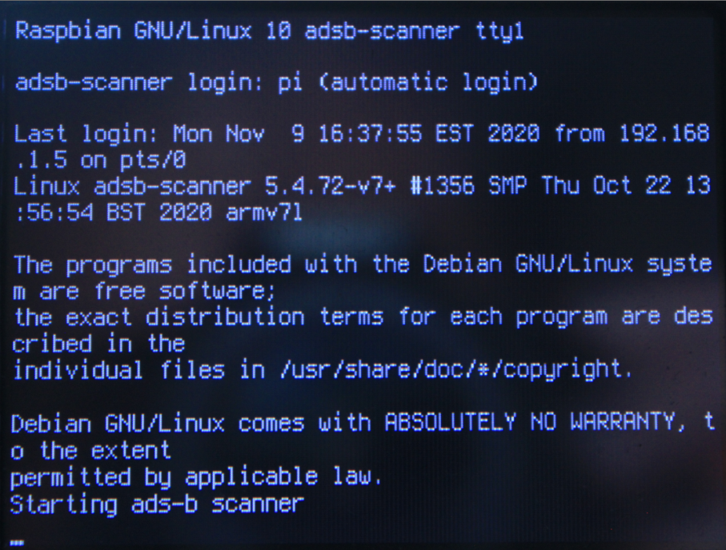
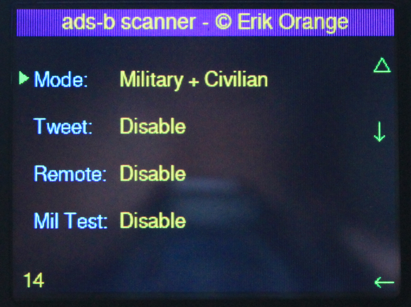
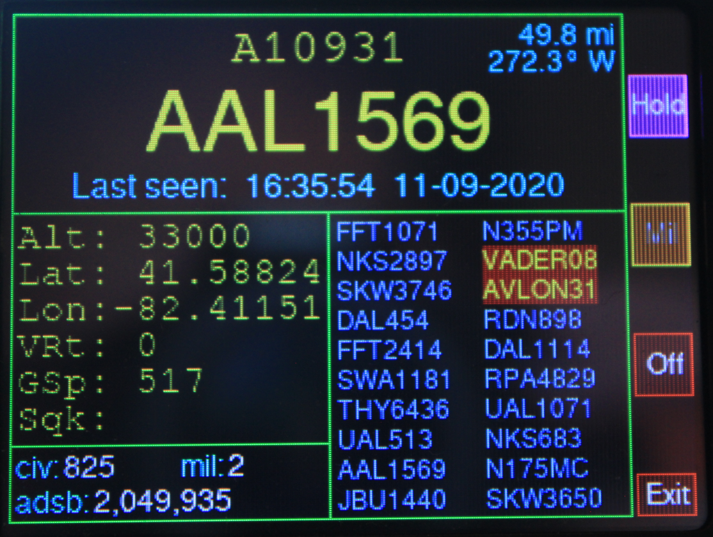
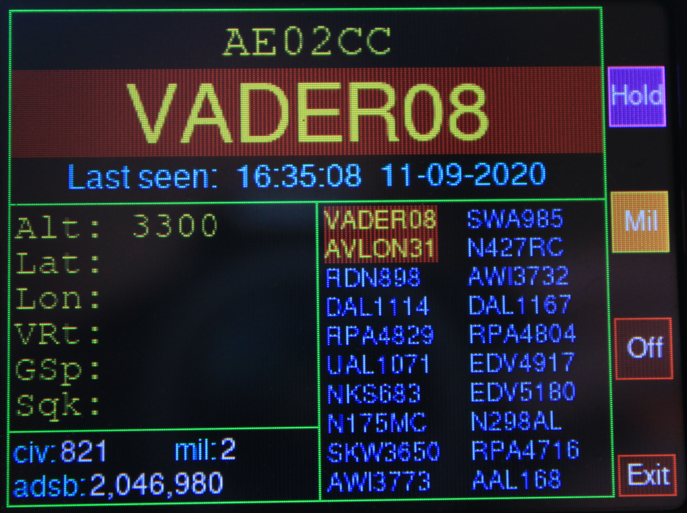

# ads-b scanner user guide

## Before You Begin
1. Plus the RTL-SDR into any USB port.
2. Attach the antenna to the RTL-SDR.  You may get better results by placing the antenna near a window.  Experiment.
3. Orient the Pi so the mechanical pushbuttons are on the right.
4. Connect the power to boot the Pi.
5. The touchscreen is not active.  Use the mechanical pushbuttons.

## Starting Up
You will see many OS messages scroll by as the Pi boots.  The boot will be finished once you see __Starting ads-b scanner__ at the bottom:

The GUI will then appear.

## Options
The first screen you will see is an Options page, which allows you to adjust how the scanner works.

- The green pointer on the left indicates the current option.
- Pressing △ will cycle through the choices for this option.
- Pressing ↓ will move the green pointer to the next option.
- Pressing ← will exit the Options page and start the scanner.

A 20 second countdown timer appears in the lower left.  If no buttons are pressed, the coundown timer will reach 0 and the scanner will start.  Each button press will reset the countdown timer to 20 seconds.

### Explanation of Options
__Mode__
- Military + Civilian: will track both types of airplanes.
- Military Only: will only track Military airplanes.

This mode can be changed using the __Mil__ button after the scanner starts.

__Tweet__
- Disable: No tweets will be sent to your Twitter account.  Keep this disabled if you didn't set up Twitter.
- Military Only: only tweet when Military airplane are detected.
- Military + Civilian: tweet when either type of airplane is detected.

Military airplanes are tweeted immediately.  Civilian airplanes are tweeted in batches of 10.

__Remote__
- Leave this option Disabled.  A Remote Head unit is currently under development.

__Mil Test__
- Enabling this will simulate the detection of various Military airplane.  This is mainly used for testing, since Military airplane detection is not as frequent as Civilian airplanes. Or you can enable it just to see what the Military display looks like.  Don't use this mode if you're really trying to detect Military aircraft, since you won't be able to tell what's real and what's simulated.

## Using the Scanner
The main display looks like this:

The scanner constantly looks for airplanes. The display will change rapidly since many airplanes are flying simultaneously.

### Top Section
The 6 digit hex number is the ICAO 24-bit address of the airplane.
The large text is the airplane's callsign.
__Last seen:__ is the last time this airplane was detected.
The distance and bearing of this airplane relative to your position is displayed in the upper right, and is only available in __Hold__ mode.

### Left Section
This is the flight data, which is available in __Hold__ mode.  Occasionally, you might see some flight data when not in __Hold__ mode, but this is rare.  See __Hold__ mode for more explanation.

The flight data consists of the current Altitude, Latitude, Longitude, Vertical Rate, Ground Speed (in knots), and the Squawk code.  Not all airplanes transmit all flight data.  Some airplanes don't transmit any flight data.

### Right Section
This is a scrolling list of detected airplane callsigns.  The list contains unique entries only. The most recent callsign is positioned at the upper left. As more callsigns are detected, the entries move down the left column, then to the top right column, and then disappear off the bottom of the right column.

### Bottom Section
- __civ:__ The count of unique civilian aircraft.
- __mil:__ The count of unique military aircraft.
- __adsb:__ The total count of data records received.

### Buttons
__Hold__

Flight Data is not always sent down in one data record.  Many records must be received in order to gather all possible flight data.  And, data records from many airplanes are received in an interleaved manner.

Enabling __Hold__ mode tells the scanner to just focus on the currently displayed callsign, and only update the display when data for _that_ aircraft is received.  This is how the scanner aggregates and updates Flight Data for a single airplane, and is also why the distance and bearing - which depends on the latitude and longitude - is only available in __Hold__ mode.

Eventually, the airplane will fly too far away and you will be out of range for its transmisions.  The Flight Data will no longer update when that happens, along with the __Last seen__ timestamp. Press __Hold__ again to exit Hold mode.

__Mil__

Enabling __Mil__ mode tells the scanner to just focus on airplanes that have a Military callsign.  Military callsigns are rendered on a red background for visibility.  You can also use __Hold__ mode in conjunction with __Mil__ mode.

__Off__

This button gracefully shuts down the Pi.  The Pi is incapable of powering itself off, so look for the final _power off_ message, which appears when the scrolling messages stop.  Then you can remove power.

__Always__ use the __Off__ button to shut down the scanner!  __Never__ just pull the power. Interrupting the power increases the risk of corrupted OS files, and things will begin to not work properly.  You'll then need to reinstall the OS and configuration again from scratch.

__Exit__

This stops the scanner and returns you to the OS shell on the TFT display.

## Log Files
The scanner creates the __~/adsb-scanner/logs__ directory.  This directory further contains datestamped directories.  In each of those directories are 3 log files:
- Civilian log file - contains a unique list of all detected civilian callsigns.
- Military log file - contains a unique list of all detected military callsigns.
- adsb record log file - a running collection of every raw data record received.

These logs are always updated no matter which Option or Mode is chosen.

The __civ__, __mil__, and __adsb__ counts on the bottom of the screen correspond to the number of rows in these log files.

